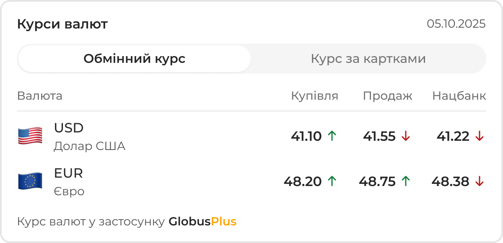

<div align="center">




# 💰 GlobusPlus Currency Widget

**Віджет курсу валют для вашого сайту**

[](https://github.com/globusplus/currency-widget)
[](LICENSE)
[](https://developer.mozilla.org/en-US/docs/Web/JavaScript)
[](https://preactjs.com/)

*Легкий та потужний інструмент для відображення актуальних курсів валют на вашому сайті*

[🚀 Швидкий старт](#-швидкий-старт) • [💻 Використання](#-використання) • [⚙️ Конфігурація](#️-конфігурація) • [🤝 Підтримка](#-підтримка)

</div>

---

## 🎯 Про проект

**GlobusPlus Currency Widget** — сучасний віджет курсу валют для інтеграції з веб-сайтами. Відображає актуальні курси USD та EUR для обміну та карткових операцій з підтримкою курсу НБУ.

### ✨ Можливості

- 💵 **USD/EUR** курси валют з НБУ
- 🔄 **Два режими**: обмінний та картковий курс
- 📊 **Індикатори трендів** з кольоровою індикацією
- 📱 **Адаптивний дизайн** для всіх пристроїв
- ⚡ **Легкий бандл** (~20KB) на Preact
- 🎨 **Сучасний UI** з плавними анімаціями

---

## 🚀 Швидкий старт

### 1. Підключіть файли

```html
<!DOCTYPE html>
<html>
<head>
    <!-- CSS -->
    <link rel="stylesheet" href="https://cdn.jsdelivr.net/npm/gp-currency-widget@1.0.0/gp-currency-widget.css">
</head>
<body>
    <!-- Контейнер віджета -->
    <div data-gp-currency-widget></div>
    
    <!-- JavaScript -->
    <script src="https://cdn.jsdelivr.net/npm/gp-currency-widget@1.0.0/gp-currency-widget.iife.js" defer></script>
</body>
</html>
```

### 2. Альтернативні методи

```html
<!-- З користувацьким ID -->
<div id="globusPlusCurrencyWidget"></div>

<!-- Ручна ініціалізація -->
<script>
window.GPCurrencyWidget.init();
</script>
```

---

## 💻 Використання

### Базова інтеграція

```html
<div data-gp-currency-widget></div>
```

---

## 🤝 Підтримка

### 📞 Зв'язок з нами

- 🌐 **Сайт**: [globusplus.ua](https://globusplus.ua)
- 📱 **Instagram**: [@globusplus.ua](https://www.instagram.com/globusplus.ua/)
- 📧 **Email**: support@globusplus.ua

### ❓ FAQ

**Чи можна використовувати безкоштовно?**  
Так, для некомерційного використання та клієнтів GlobusPlus.

**Які валюти підтримуються?**  
USD та EUR. Плануємо додати GBP, PLN.

**Як часто оновлюються курси?**  
Кожні 15 хвилин з офіційних джерел GlobusPlus.

---

## 📄 Ліцензія

MIT License © 2025 GlobusPlus. Всі права захищені.

---

<div align="center">

**Зроблено з ❤️ командою GlobusPlus**

[](https://github.com/globusplus/currency-widget/stargazers)
[](https://github.com/globusplus/currency-widget/network/members)
[](https://www.instagram.com/globusplus.ua/)
</div>